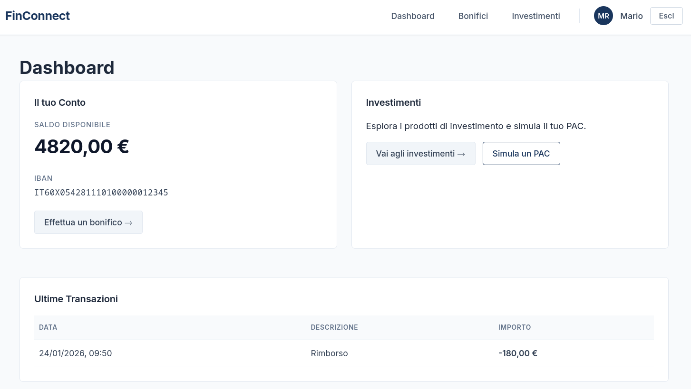
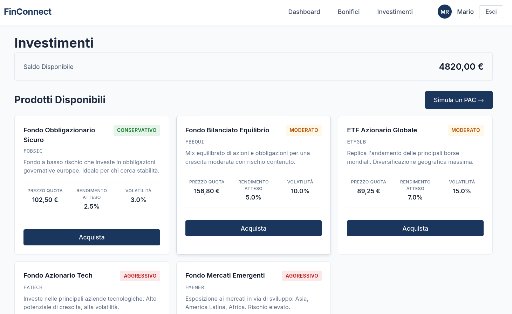
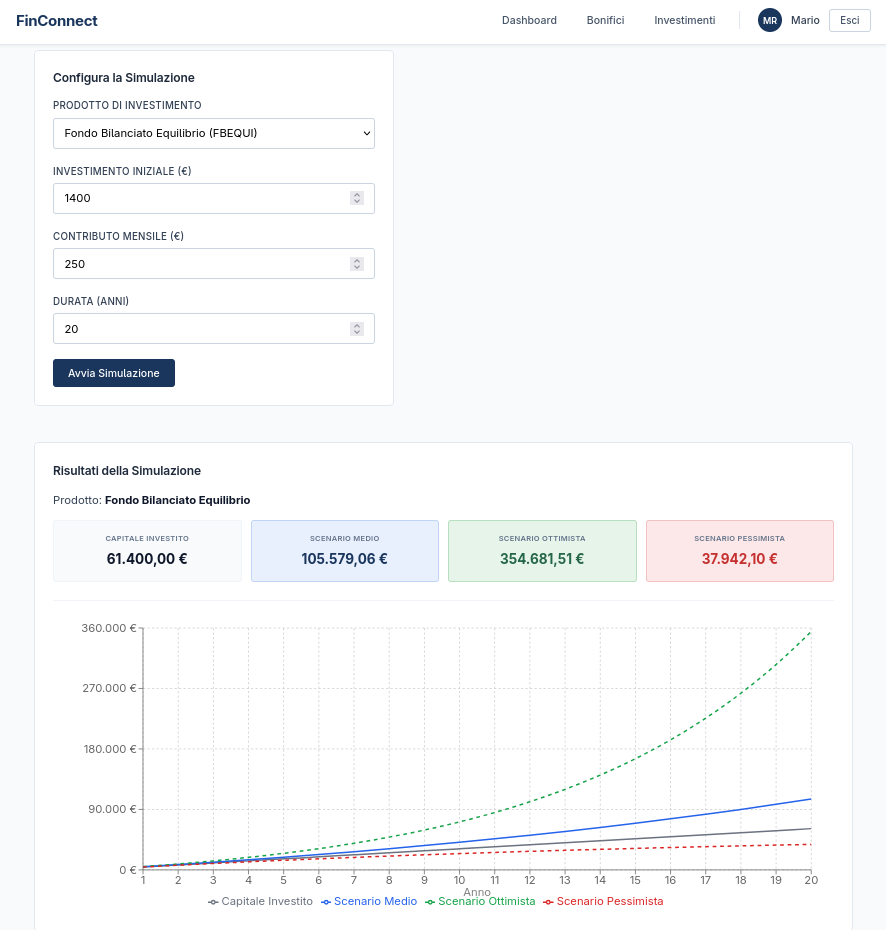
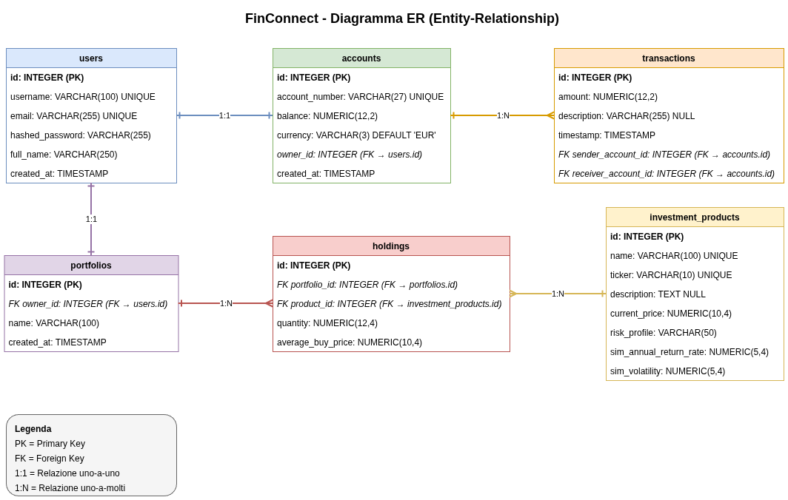
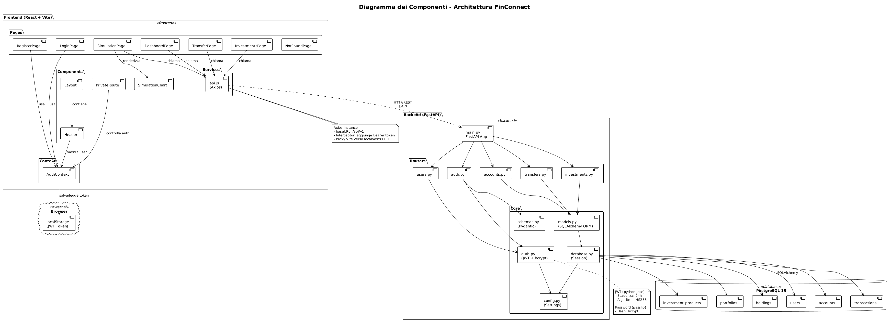
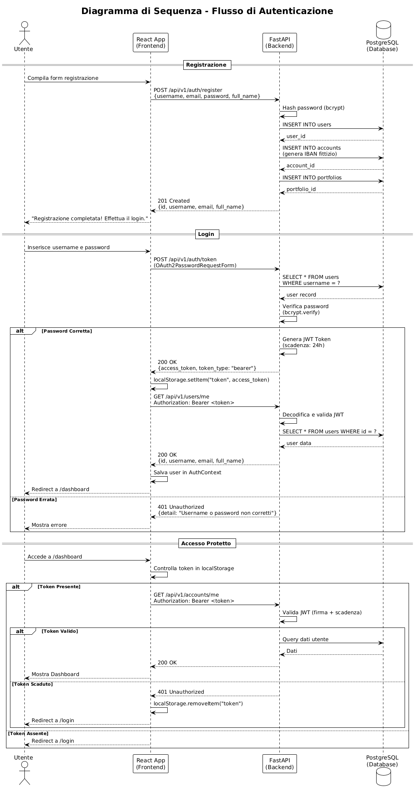
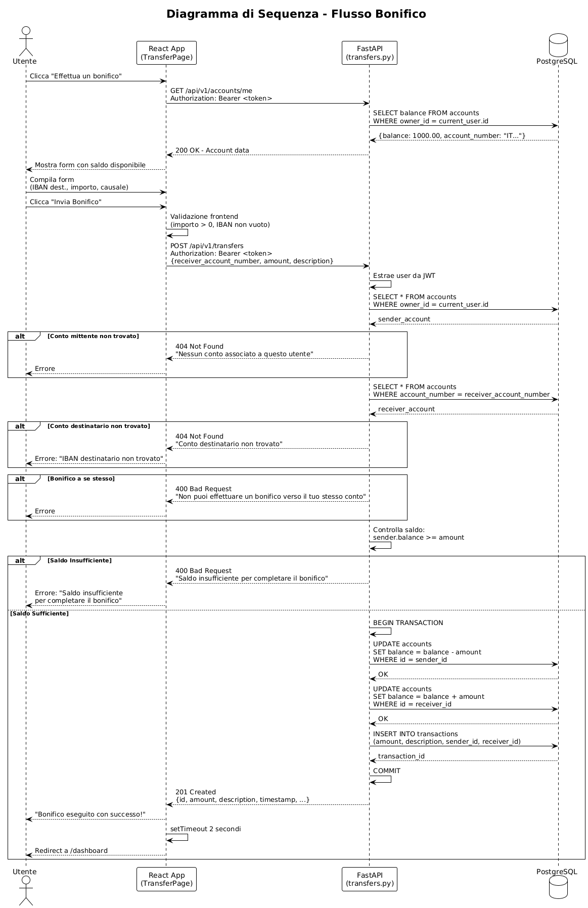

# FinConnect

**Prototipo di Sistema di Home Banking con Simulazione di Investimenti**

[](https://python.org)
[](https://fastapi.tiangolo.com)
[](https://react.dev)
[](https://postgresql.org)
[](LICENSE)

---

## Sommario

- [Introduzione](#introduzione)
- [Contesto Accademico](#contesto-accademico)
- [Architettura del Sistema](#architettura-del-sistema)
- [Stack Tecnologico](#stack-tecnologico)
- [Requisiti di Sistema](#requisiti-di-sistema)
- [Installazione e Deployment](#installazione-e-deployment)
- [Struttura del Progetto](#struttura-del-progetto)
- [API Reference](#api-reference)
- [Screenshot](#screenshot)
- [Credenziali Demo](#credenziali-demo)
- [Documentazione](#documentazione)
- [Licenza](#licenza)
- [Autore](#autore)

---

## Introduzione

**FinConnect** è un prototipo funzionale di applicazione di *Home Banking* sviluppato come progetto di tesi per il Corso di Laurea Triennale in Informatica per le Aziende Digitali (L-31).

Il sistema implementa le funzionalità fondamentali di un'applicazione bancaria moderna:

- **Autenticazione sicura** tramite JSON Web Token (JWT)
- **Gestione del conto corrente** con visualizzazione saldo e movimenti
- **Esecuzione di bonifici** tra conti interni al sistema
- **Portafoglio investimenti** con acquisto e vendita di prodotti finanziari simulati
- **Simulazione Monte Carlo** per la proiezione di Piani di Accumulo del Capitale (PAC)

L'obiettivo del progetto è dimostrare la capacità di progettare e implementare un'architettura software full-stack, applicando le competenze acquisite durante il percorso di studi in ambito di sviluppo web, basi di dati e ingegneria del software.

---

## Contesto

|                     |                                                    |
|---------------------|----------------------------------------------------|
| **Titolo Tesi**     | Progettazione e Sviluppo di un Prototipo di Home Banking con Simulazione di Investimenti |
| **Corso di Laurea** | Informatica per le Aziende Digitali (L-31)         |
| **Anno Accademico** | 2025/2026                                          |
| **Candidato**       | Francesco Stabile                                |

---

## Architettura del Sistema

Il progetto adotta un'architettura **three-tier** con separazione netta tra i livelli di presentazione, logica applicativa e persistenza dei dati.

```
┌────────────────────────────────────────────────────────────────┐
│                      PRESENTATION LAYER                        │
│                                                                │
│    ┌─────────────────────────────────────────────────────┐     │
│    │              React 19 + Vite + React Router         │     │
│    │                   (localhost:5173)                  │     │
│    └─────────────────────────────────────────────────────┘     │
│                              │                                 │
│                         HTTP/JSON                              │
│                         (Axios)                                │
│                              │                                 │
├──────────────────────────────┼─────────────────────────────────┤
│                      APPLICATION LAYER                         │
│                              │                                 │
│    ┌─────────────────────────────────────────────────────┐     │
│    │                 FastAPI + SQLAlchemy                │     │
│    │                   (localhost:8000)                  │     │
│    │                                                     │     │
│    │  ┌──────────┐ ┌──────────┐ ┌───────────┐            │     │
│    │  │  Auth    │ │ Accounts │ │Investments│            │     │
│    │  │  Router  │ │  Router  │ │  Router   │            │     │
│    │  └──────────┘ └──────────┘ └───────────┘            │     │
│    └─────────────────────────────────────────────────────┘     │
│                              │                                 │
│                      SQLAlchemy ORM                            │
│                              │                                 │
├──────────────────────────────┼─────────────────────────────────┤
│                        DATA LAYER                              │
│                              │                                 │
│    ┌─────────────────────────────────────────────────────┐     │
│    │                  PostgreSQL 15                      │     │
│    │                   (localhost:5432)                  │     │
│    └─────────────────────────────────────────────────────┘     │
└────────────────────────────────────────────────────────────────┘
```

### Pattern Architetturali Adottati

- **RESTful API Design**: Endpoint conformi ai principi REST con verbi HTTP semantici
- **Repository Pattern**: Separazione tra logica di business e accesso ai dati tramite ORM
- **JWT Stateless Authentication**: Autenticazione senza sessione lato server
- **Single Page Application (SPA)**: Interfaccia utente reattiva con routing client-side

---

## Stack Tecnologico

### Backend

| Componente | Tecnologia | Versione | Finalità |
|------------|------------|----------|----------|
| Framework Web | FastAPI | 0.115+ | API REST con validazione automatica |
| ORM | SQLAlchemy | 2.0 | Mapping oggetto-relazionale e gestione delle transazioni |
| Validazione | Pydantic | 2.0 | Validazione e serializzazione dei dati in ingresso/uscita |
| Migrazioni | Alembic | 1.13+ | Versionamento e migrazione dello schema database |
| Autenticazione | python-jose | — | Generazione e verifica dei token JWT |
| Hashing | passlib + bcrypt | — | Hashing sicuro delle password |

### Frontend

| Componente | Tecnologia | Versione | Finalità |
|------------|------------|----------|----------|
| Libreria UI | React | 19.2 | Costruzione dell'interfaccia utente component-based |
| Build Tool | Vite | 7.2 | Bundling e Hot Module Replacement |
| Routing | React Router DOM | 7.13 | Navigazione SPA client-side |
| HTTP Client | Axios | 1.13 | Comunicazione con le API REST |
| Grafici | Recharts | 3.7 | Visualizzazione dati e risultati simulazioni |

### Infrastruttura

| Componente | Tecnologia | Versione | Finalità |
|------------|------------|----------|----------|
| Database | PostgreSQL | 15 | Persistenza relazionale ACID-compliant |
| Containerizzazione | Docker | 24+ | Isolamento e portabilità dell'ambiente |
| Orchestrazione | Docker Compose | V2 | Gestione multi-container |

---

## Requisiti di Sistema

Per eseguire l'applicazione in ambiente locale sono necessari:

| Software | Versione Minima | Note |
|----------|-----------------|------|
| Docker Engine | 24.0+ | Con Docker Compose V2 integrato |
| Node.js | 18.0+ LTS | Consigliato: v20 LTS |
| npm | 9.0+ | Distribuito con Node.js |
| Git | 2.0+ | Per il clone del repository |

---

## Installazione e Deployment

### 1. Clone del Repository

```bash
git clone https://github.com/FrancescoStabile/FinConnect
cd FinConnect
```

### 2. Configurazione Variabili d'Ambiente

```bash
cp .env.example .env
```

Modificare il file `.env` secondo le proprie esigenze. Le variabili principali sono:

| Variabile | Descrizione |
|-----------|-------------|
| `SECRET_KEY` | Chiave per la firma dei token JWT (min. 32 caratteri) |
| `DATABASE_URL` | Stringa di connessione PostgreSQL |
| `DEBUG` | Modalità debug (`True`/`False`) |

### 3. Avvio dei Servizi Backend

```bash
docker compose up -d
```

Verificare lo stato dei container:

```bash
docker compose ps
```

> **Nota:** All'avvio, il backend esegue automaticamente le migrazioni del database e popola i dati demo (utenti, conti, prodotti di investimento). Non è richiesta alcuna operazione manuale.

### 4. Avvio del Frontend

```bash
cd frontend
npm install
npm run dev
```

### 5. Accesso all'Applicazione

| Servizio | URL |
|----------|-----|
| Frontend | http://localhost:5173 |
| Backend API | http://localhost:8000 |
| Documentazione API (Swagger) | http://localhost:8000/docs |
| Documentazione API (ReDoc) | http://localhost:8000/redoc |

---

## Struttura del Progetto

```
FinConnect/
│
├── backend/                    # Sottosistema Backend
│   ├── app/
│   │   ├── main.py            # Entry point FastAPI
│   │   ├── config.py          # Configurazione (Pydantic Settings)
│   │   ├── database.py        # Setup SQLAlchemy e sessione DB
│   │   ├── models.py          # Modelli ORM (User, Account, Transaction, ...)
│   │   ├── schemas.py         # Schemi Pydantic per validazione I/O
│   │   ├── auth.py            # Logica autenticazione JWT
│   │   └── routers/           # Endpoint API organizzati per dominio
│   │       ├── auth.py        # /api/v1/auth/*
│   │       ├── users.py       # /api/v1/users/*
│   │       ├── accounts.py    # /api/v1/accounts/*
│   │       ├── transfers.py   # /api/v1/transfers/*
│   │       └── investments.py # /api/v1/investments/*
│   ├── alembic/               # Migrazioni database
│   ├── tests/                 # Test unitari e di integrazione
│   ├── Dockerfile             # Immagine container backend
│   ├── requirements.txt       # Dipendenze Python
│   └── seed_data.py           # Script popolamento dati demo
│
├── frontend/                   # Sottosistema Frontend
│   ├── src/
│   │   ├── main.jsx           # Entry point React
│   │   ├── App.jsx            # Componente root e routing
│   │   ├── components/        # Componenti UI riutilizzabili
│   │   │   ├── Header.jsx
│   │   │   ├── Layout.jsx
│   │   │   ├── PrivateRoute.jsx
│   │   │   └── SimulationChart.jsx
│   │   ├── pages/             # Componenti pagina (route-level)
│   │   │   ├── LoginPage.jsx
│   │   │   ├── RegisterPage.jsx
│   │   │   ├── DashboardPage.jsx
│   │   │   ├── TransferPage.jsx
│   │   │   ├── InvestmentsPage.jsx
│   │   │   └── SimulationPage.jsx
│   │   ├── context/           # React Context (stato globale)
│   │   │   └── AuthContext.jsx
│   │   └── services/          # Client API
│   │       └── api.js
│   ├── package.json
│   └── vite.config.js
│
├── docs/                       # Documentazione tecnica
│   ├── diagrams/              # Diagrammi
│   └── screenshots/           # Screenshot UI
│
├── docker-compose.yml          # Orchestrazione container
├── .env.example                # Template variabili d'ambiente
└── README.md                   # Questo file
```

---

## API Reference

L'API segue i principi RESTful ed è organizzata nei seguenti moduli:

### Autenticazione

| Metodo | Endpoint | Descrizione |
|--------|----------|-------------|
| `POST` | `/api/v1/auth/register` | Registrazione nuovo utente |
| `POST` | `/api/v1/auth/token` | Login e ottenimento token JWT |

### Utenti

| Metodo | Endpoint | Auth | Descrizione |
|--------|----------|------|-------------|
| `GET` | `/api/v1/users/me` | 🔒 | Profilo utente corrente |

### Conti

| Metodo | Endpoint | Auth | Descrizione |
|--------|----------|------|-------------|
| `GET` | `/api/v1/accounts/me` | 🔒 | Dettagli conto corrente |
| `GET` | `/api/v1/accounts/me/transactions` | 🔒 | Lista movimenti |

### Bonifici

| Metodo | Endpoint | Auth | Descrizione |
|--------|----------|------|-------------|
| `POST` | `/api/v1/transfers` | 🔒 | Esecuzione bonifico |

### Investimenti

| Metodo | Endpoint | Auth | Descrizione |
|--------|----------|------|-------------|
| `GET` | `/api/v1/investments/products` | 🔒 | Lista prodotti disponibili |
| `GET` | `/api/v1/investments/portfolio` | 🔒 | Portafoglio utente |
| `POST` | `/api/v1/investments/buy` | 🔒 | Acquisto quote |
| `POST` | `/api/v1/investments/sell` | 🔒 | Vendita quote |
| `POST` | `/api/v1/investments/simulate` | 🔒 | Simulazione Monte Carlo PAC |

> 🔒 = Richiede header `Authorization: Bearer <token>`

La documentazione interattiva completa è disponibile su `/docs` (Swagger UI) con il backend in esecuzione.

---

## Screenshot

Di seguito alcune schermate dell'applicazione che illustrano le principali funzionalità.

### Dashboard

La schermata principale mostra il saldo disponibile, l'IBAN del conto e lo storico delle ultime transazioni.



### Catalogo Investimenti

L'utente può visualizzare i prodotti finanziari disponibili, ciascuno con indicazione del profilo di rischio, rendimento atteso e volatilità.



### Simulazione PAC

Il simulatore permette di proiettare l'evoluzione di un Piano di Accumulo del Capitale su un orizzonte temporale configurabile, mostrando scenari pessimista, medio e ottimista.



---

## Credenziali Demo

All'avvio del sistema, vengono creati automaticamente i seguenti utenti di test:

| Username | Password | Saldo Iniziale |
|----------|----------|----------------|
| `mario.rossi` | `password123` | € 5.000,00 |
| `giulia.bianchi` | `password123` | € 3.500,00 |
| `luca.verdi` | `password123` | € 8.000,00 |

---

## Documentazione

La documentazione tecnica del progetto include i seguenti artefatti, consultabili nella directory [docs/diagrams/](docs/diagrams/):

### Diagramma Entità-Relazioni (ER)

Schema concettuale del database che illustra le entità principali (User, Account, Transaction, Portfolio, Holding, InvestmentProduct) e le relative associazioni.



### Diagramma dei Componenti

Rappresentazione dell'architettura software che evidenzia la suddivisione in moduli e le dipendenze tra i componenti del sistema.



### Sequence Diagram: Autenticazione

Flusso di interazione tra Client, API e Database durante il processo di login e generazione del token JWT.



### Sequence Diagram: Bonifico

Flusso di interazione per l'esecuzione di un bonifico, dalla validazione della richiesta all'aggiornamento dei saldi.



### Documentazione API

La specifica OpenAPI 3.0 è consultabile interattivamente:
- **Swagger UI**: http://localhost:8000/docs
- **ReDoc**: http://localhost:8000/redoc

---

## Licenza

Questo progetto è rilasciato con licenza MIT. Vedere il file [LICENSE](LICENSE) per i dettagli.

---

## Autore

**Francesco Stabile**

Corso di Laurea in Informatica per le Aziende Digitali (L-31)  

---

<p align="center">
  <i>Progetto sviluppato come elaborato di tesi triennale</i>
</p>
